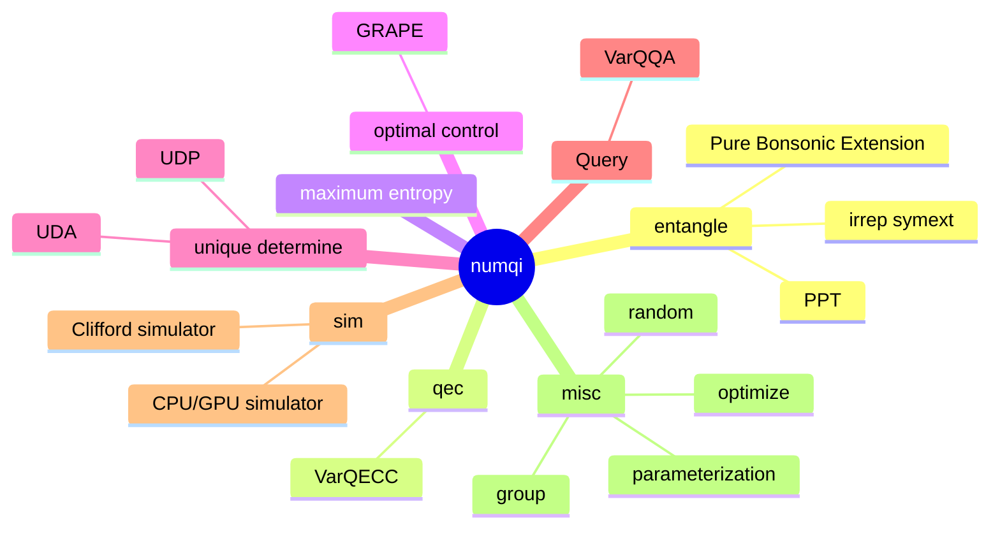
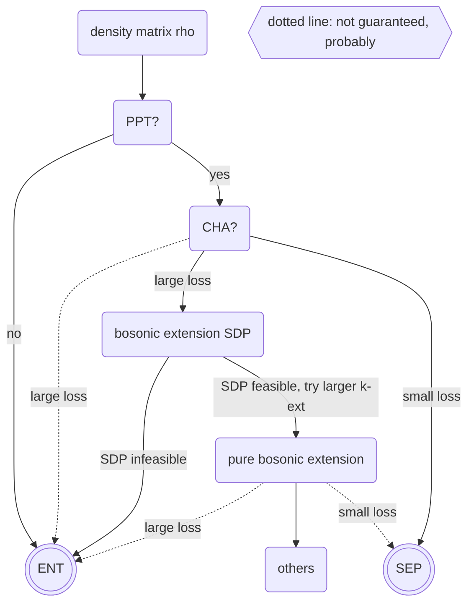

# numqi: a quantum information toolbox implemented in numpy

[](https://codecov.io/gh/husisy/numqi)

WARNING: no backward compatibility guarantee until version `1.0.0`

1. A numpy based quantum simulator, for quick development only, not performance-optimized
   * `.state`, `.dm`, `.gate` module
   * gradient back-propagation is supported
   * TODO gradient back-propagation for density matrix
2. parameterization of various stuff
   * `.param`: special unitary matrix, special orthogonal matrix, density matrix, quantum channel, etc.
   * `.random`: randomly generate these kind of things
3. special states, matrices
   * `.gellmann`: convert matrix into gellmann basis and reversally
   * `.dicke`: convert bosonic symmetrically state into Dicke basis and reversally
4. quantum operation
   * `.gate`: various unitary matrix, like Pauli gate, Clifford gate, etc.
   * `.channel`: different representation of quantum channel, like Choi, Kraus, Super-op, partial trace of unitary
5. `numqi.entangle` detect entanglement
   * Positive Partial transpose
   * convex hull approximation
   * Pure Bosonic extension, pure bonsonic extension model on nisq quantum circuits
   * unextendible product state, bound extangled state
6. `numqi.qec` quantum error correction
   * well known QECC, like `((5,2,3))`, `((8,8,3))`
   * `VarQEC`: variational learning for quantum error-correcting codes
7. `numqi.query`: TODO
8. `numqi.maximum_entropy`: witness about the quantum state

## quickstart

more detailed installation instructions see [docs/installation](./docs/installation.md)

```bash
# TODO upload to pypi.org
pip install numqi
```

A simple example to detect whether Bell state [wiki](https://en.wikipedia.org/wiki/Bell_state) is entangle or not using positive partial transpose (PPT) criteria.

```Python
import numqi
bell_state = numqi.state.Werner(d=2, alpha=1)
print(bell_state) #a numpy array
# [[ 0.   0.   0.   0. ]
#  [ 0.   0.5 -0.5  0. ]
#  [ 0.  -0.5  0.5  0. ]
#  [ 0.   0.   0.   0. ]]
print(numqi.entangle.is_ppt(bell_state)) #True if seperable state, False is entangle state (small probability also return True)
# False
```

folder structure

1. `python/numqi/`: source code
2. `docs/`: kinds of markdown files for generating website
3. `tests/`: unit tests
4. `examples/`: single file scripts to demonstrate how to use `numqi`
5. `project/`: some projects based on `numqi`, whether finished or not
6. misc
   * `README.md`: this file
   * `pyproject.toml`: to make a pip-instalable package
   * `mkdocs.yml`: to generate website
   * `LICENSE`
   * `.gitignore`

## How to contribute

see [docs/installation/for-developer](./docs/installation.md/#for-developer)

## mermaid diagram

Since mkdocs-material not supported the mermaid-10.x [mkdocs-material/issue](https://github.com/squidfunk/mkdocs-material/issues/5193), while github web support it, let's put all these mermaid diagram here and make a screenshot on the [mermaid-live-editor](https://mermaid.live/)

project structure




