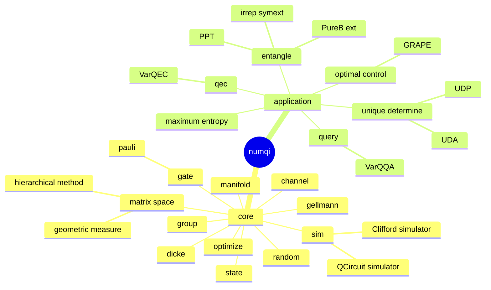
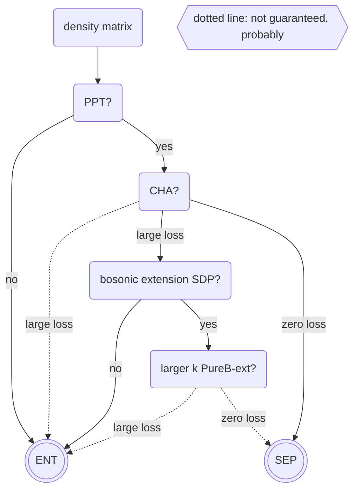

# numqi: a quantum information package based on numpy

[](https://codecov.io/gh/husisy/numqi)

WARNING: no backward compatibility guarantee until version `1.0.0`

keyword: quantum information, numpy, pytorch, manifold optimization, trivialization

module structure



core modules

1. `numqi.sim`: numpy based quantum simulator [wiki/quantum-simulator](https://en.wikipedia.org/wiki/Quantum_simulator), support gradient back-propagation and variational quantum circuits, Clifford circuit simulator
2. `numqi.dicke`: Dicke basis, bosonic states
3. `numqi.random`: sample random quantum states, matrices, channels, etc.
4. `numqi.state`: various quantum states, like Werner state, Bell state, etc. and their properties like entanglement measure, etc.
5. `numqi.gate`: various quantum gate [wiki/quantum-logic-gate](https://en.wikipedia.org/wiki/Quantum_logic_gate), like Pauli gate (various representation), Clifford gate, etc.
6. `numqi.gellmann`: convert matrix into gellmann basis and reversally [wiki/gellmann](https://en.wikipedia.org/wiki/Gell-Mann_matrices) [wiki/generalized-gellmann](https://en.wikipedia.org/wiki/Generalizations_of_Pauli_matrices)
7. `numqi.channel`: utilities related to quantum channel, like conversion between different representations of a quantum channel (Kraus operator, super-operator, Choi state, etc.) [wiki/quantum-channel](https://en.wikipedia.org/wiki/Quantum_channel)
8. `numqi.manifold`: trivialzation of various smooth manifolds and quantum objects
   * smooth manifold: sphere, positive semi-definite matrix, special orthogonal / unitary group, Stiefel manifold etc.
   * quantum object: denotes quantum state, quantum gate, Hamiltonian, quantum channel etc.
9. `numqi.group`: some basic utility for group theory [wiki/group](https://en.wikipedia.org/wiki/Group_(mathematics)), like irreducible representation, symmetric group, Symplectic group over finite field `Sp(2n, F2)`, etc.
10. `numqi.optimize`: wrapper of `scipy.optimize` and `SGD/Adam` optimizers for manifold optimization
11. `numqi.matrix_space`: Numerical range, linear space of matrices, geometric measure, hierarchical method, etc.
    * Quantifying Subspace Entanglement with Geometric Measures [arxiv-link](https://arxiv.org/abs/2311.10353)
12. `numqi.utils`: some utility functions, like, calculate fidelity, purity, entropy etc.

application modules

1. `numqi.entangle`: detect entanglement [wiki/quantum-entanglement](https://en.wikipedia.org/wiki/Quantum_entanglement)
   * PPT (positive partial transpose)
   * convex hull approximation
   * Pure Bosonic extension [arxiv-link](https://arxiv.org/abs/2209.10934)
   * irreducible representation of symmetric extension [doi-link](https://doi.org/10.3390/e25101425)
   * unextendible product state, bound extangled state, etc.
2. `numqi.maximum_entropy`: relation between Hamiltonian, groud state, and marginal problem
   * Maximum entropy methods for quantum state compatibility problems [arxiv-link](https://arxiv.org/abs/2207.11645)
3. `numqi.qec`: quantum error correction code (QECC) [wiki](https://en.wikipedia.org/wiki/Quantum_error_correction)
   * Variational learning for quantum error-correcting codes [doi-link](https://doi.org/10.22331/q-2022-10-06-828)
   * circuits to encode some well-known QECC, like `((5,2,3))`, `((8,8,3))`
4. `numqi.unique_determine`: unique determinedness in quantum state tomography
   * Variational Approach to Unique Determinedness in Pure-state Tomography [arxiv-link](https://arxiv.org/abs/2305.10811)
5. `numqi.query`: quantum query
   * Variational learning algorithms for quantum query complexity [arxiv-link](https://arxiv.org/abs/2205.07449)
6. `numqi.optimal_control`: optimal control for quantum system, e.g. finding the optimal control pulse to implement a quantum gate
   * Gradient ascent pulse engineering algorithm (GRAPE) (gradient ascent pulse engineering)

## quickstart

more detailed installation instructions see [docs/installation](./docs/installation.md)

```bash
# TODO upload to pypi.org
pip install numqi
```

A simple example to detect whether Bell state [wiki](https://en.wikipedia.org/wiki/Bell_state) is entangle or not using positive partial transpose (PPT) criteria.

```Python
import numqi
bell_state = numqi.state.Werner(d=2, alpha=1)
print(bell_state) #a numpy array
# [[ 0.   0.   0.   0. ]
#  [ 0.   0.5 -0.5  0. ]
#  [ 0.  -0.5  0.5  0. ]
#  [ 0.   0.   0.   0. ]]
print(numqi.entangle.is_ppt(bell_state, (2,2))) #True if seperable, False if entangled
# False
```

folder structure

1. `python/numqi/`: source code
2. `docs/`: kinds of markdown files for generating website
3. `tests/`: unit tests
4. `examples/`: single file scripts to demonstrate how to use `numqi`
5. `project/`: some projects based on `numqi`, whether finished or not
6. misc
   * `README.md`: this file
   * `pyproject.toml`: to make a pip-instalable package
   * `mkdocs.yml`: to generate website
   * `LICENSE`
   * `.gitignore`

## How to contribute

see [docs/installation/for-developer](./docs/installation.md/#for-developer)

## mermaid diagram

Since mkdocs-material not supported the mermaid-10.x [mkdocs-material/issue](https://github.com/squidfunk/mkdocs-material/issues/5193), while github web support it, let's put all these mermaid diagram here and make a screenshot on the [mermaid-live-editor](https://mermaid.live/)

```bash
mmdc -i numqi-module.mmd -o numqi-module.png
```

module structure


