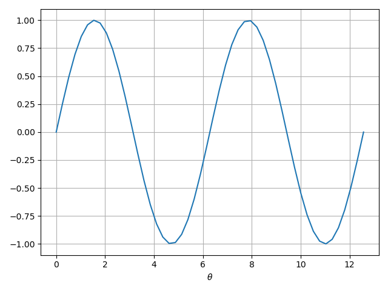

# quantum circuit

## basic circuit

Construct a "non-trival" circuit

```Python
import numpy as np
import numpyqi
circ = numpyqi.sim.Circuit()
for x in range(4):
    circ.H(x)
circ.cz(3, 4)
circ.cy(2, 3)
circ.cz(2, 4)
circ.cx(1, 2)
circ.cz(1, 3)
circ.cx(1, 4)
circ.cy(0, 2)
circ.cx(0, 3)
circ.cx(0, 4)
```

with variable `circ`, one can check its properties

```Python
circ.num_qubit #5
```

Given a initial state, `circ` can produce the final state (out-of-place operation)

```Python
initial_state = np.zeros(2**5, dtype=np.complex128)
initial_state[0] = 1
# initial_state = numpyqi.sim.state.new_base(5)
final_state_0 = circ.apply_state(initial_state)

initial_state = np.zeros(2**5, dtype=np.complex128)
initial_state[1] = 1
final_state_1 = circ.apply_state(initial_state)
```

Actually, the `final_state_0` and `final_state_1` is the `((5,2,3))` quantum error correcting code which will be discussed later. We can also the full unitary matrix

```Python
mat = circ.to_unitary() #(np,complex128,(32,32))
```

## parameterized circuit

```Python
import numpy as np
import numpyqi
circ = numpyqi.sim.Circuit(default_requires_grad=True)
gate0 = circ.ry(1)
circ.H(1)
circ.cnot(0, 1)
```

above we create a circuit with parameterized gate `gate0`. We can modify the parameter in `gate0` to get different expectation (say Pauli-Z on qubit `q1`)

```Python
import matplotlib.pyplot as plt
initial_state = numpyqi.sim.state.new_base(2)
theta = np.linspace(0, 4*np.pi)
op = [(1.0, [(numpyqi.gate.Z,1)])]
expectation = []
circ.init_theta_torch() #TODO error below if not this line
for x in theta:
    # gate0.set_args([x]) #fail TODO
    circ.name_to_pgate['ry']['theta_torch'].data[0,0] = x
    psi = circ.apply_state(initial_state)
    expectation.append(numpyqi.sim.state.inner_product_psi0_O_psi1(psi, psi, op).real)

fig,ax = plt.subplots()
ax.plot(theta, expectation)
ax.set_xlabel(r'$\theta$')
ax.grid()
fig.tight_layout()
# fig.savefig('data/circuit_basic_pgate.png')
```



## custom gate

see `script/draft_custom_gate.py`

*TODO* custom parameterized gate
