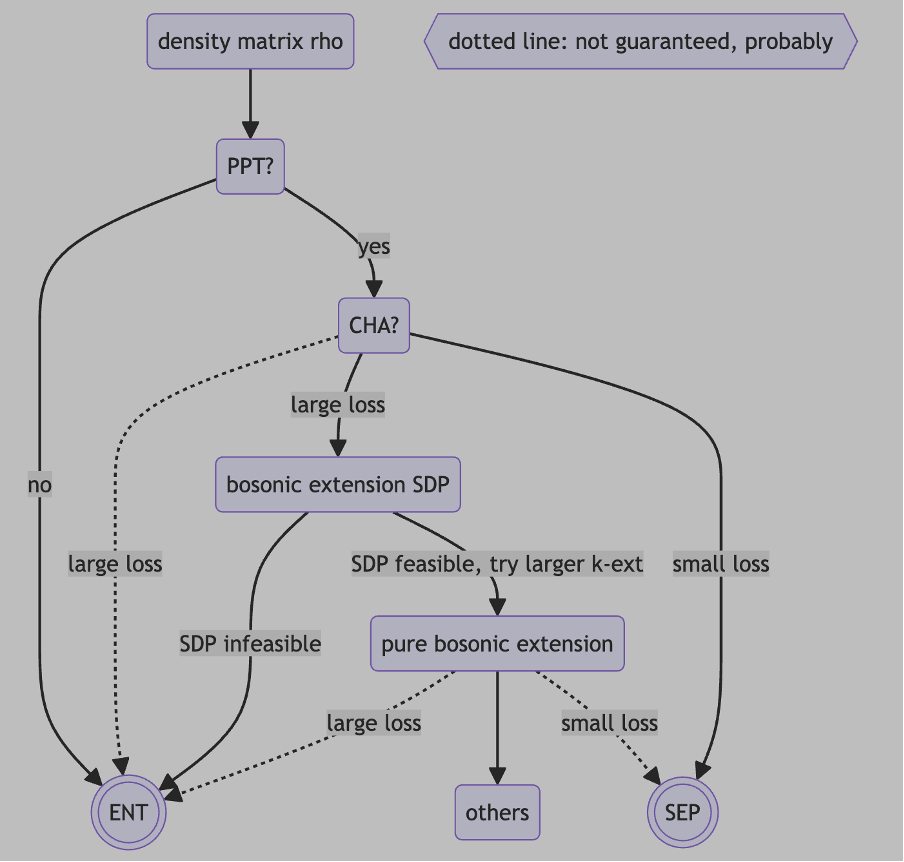

# Entanglement: Advanced-2

## Entanglement detection method

Many entanglement detection methods have been proposed. Here, we summarize the pros and cons of each method.

1. Positive Partial Transpose (PPT) criterion
    * pros: computationally efficient
    * cons: false positive (bound entangled states)
2. Convex Hull Approximation (CHA) method
    * pros: computationally efficient
    * cons: non-convex optimization
3. bosonic extension semi-definite programming (SDP)
    * pros: accurate
    * cons: computationally heavy
4. pure bosonic extension (PureB)
    * pros: computationally efficient
    * cons: correct for generic states, but not for all separable states, nor for all entangled states

To check whether a density matrix $\rho$ is entangled or not, the following is my personal recommendation



Above, `small loss` means the minimized loss is smaller than some predefined threshold (e.g. `1e-12` for double precision), and `large loss` means the minimized loss is larger than this threshold.

```Python
import numpy as np

import numqi

dimA = 3
dimB = 3

dm0 = numqi.random.rand_density_matrix(dimA*dimB, k=2*dimA*dimB)

tag_ppt = numqi.entangle.is_ppt(dm0, (dimA,dimB), eps=-1e-7)
if not tag_ppt:
    print('[entangled] dm0 is not PPT')
else:
    eps = 1e-10
    model_cha = numqi.entangle.AutodiffCHAREE(dimA, dimB)
    model_cha.set_dm_target(dm0)
    loss_cha = numqi.optimize.minimize(model_cha, num_repeat=3, tol=1e-12, print_every_round=0).fun
    tag_cha = loss_cha < eps
    if tag_cha:
        print(f'[separable] dm0 has seperable decomposition, loss={loss_cha}')
    else:
        tag_kext = numqi.entangle.is_ABk_symmetric_ext(dm0, (dimA,dimB), kext=4, use_ppt=True, use_boson=True)
        if not tag_kext:
            print('[entangled] dm0 is not bosonic extendable')
        else:
            model_pureb = numqi.entangle.PureBosonicExt(dimA, dimB, kext=32)
            model_pureb.set_dm_target(dm0)
            loss_pureb = numqi.optimize.minimize(model_pureb, num_repeat=3, tol=1e-12, print_every_round=0).fun
```
