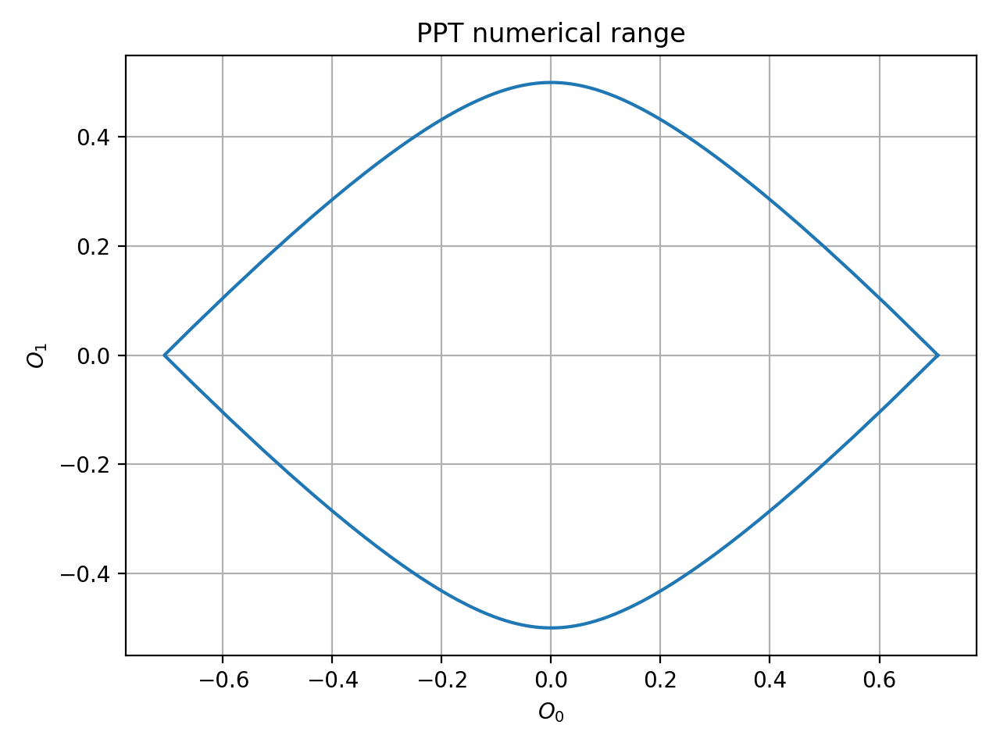

# PPT criteria

```Python
import numpy as np
import matplotlib.pyplot as plt
import numqi
```

## numerical range

```Python
sx = np.array([[0,1],[1,0]])
sy = np.array([[0,-1j],[1j,0]])
sz = np.array([[1,0],[0,-1]])
op0 = np.kron(np.array([[1/np.sqrt(2),0],[0,0]]), sz)
op1 = (np.kron(sy, sx) - np.kron(sx, sy)) / 2
theta_list = np.linspace(0, 2*np.pi, 400)
direction = np.stack([np.cos(theta_list), np.sin(theta_list)], axis=1)
z0 = numqi.entangle.get_ppt_numerical_range([op0, op1], direction, dim=(2,2))

fig,ax = plt.subplots()
tmp0 = z0.reshape(-1,1)*direction
ax.plot(tmp0[:,0], tmp0[:,1])
ax.set_title('PPT numerical range')
ax.grid()
ax.set_xlabel('$O_0$')
ax.set_ylabel('$O_1$')
fig.tight_layout()
```


