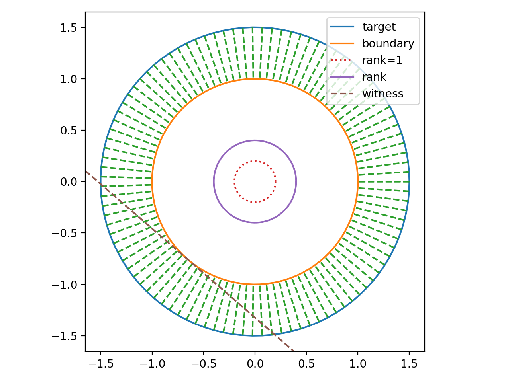
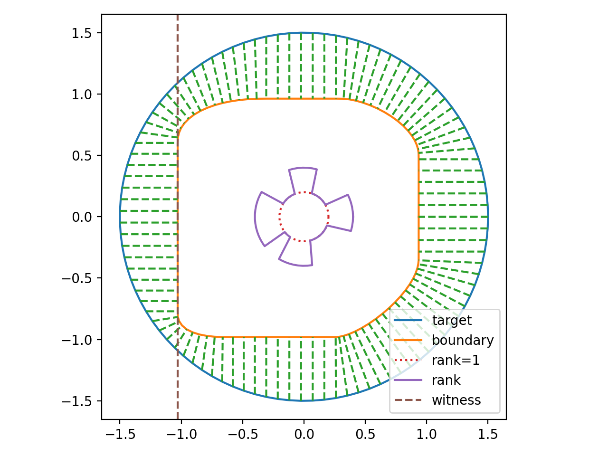
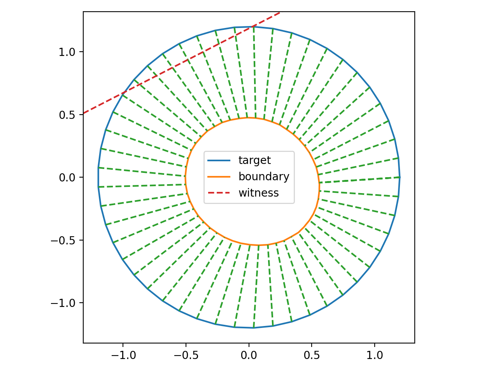

# Maximum entropy method

time benchmark information

| #qubit | maxent time (s) | sdp time (s)
| :-: | :-: | :-: |
| 3 | 0.146 | 0.015 |
| 4 | 0.092 | 0.031 |
| 5 | 0.288 | 0.072 |
| 6 | 0.660 | 0.200 |
| 7 | 1.785 | 0.756 |
| 8 | 12.267 | 4.313 |

1. CPU: AMD R7 5800H, 16 cores (hyperthread counted)
2. average over 3 randomly generated density matrix
3. complete 2local operators
4. potential advantage
    * pytorch model can be port to GPU device, which may have 10 times speedup
    * in benchmark, only 2-local operators are used. If we use include more operators, the time for maximum entropy method will not change apparently, while the time for SDP will increase
    * sparse matrix exponential algorithm is needed to boost the performance of maximum entropy method

